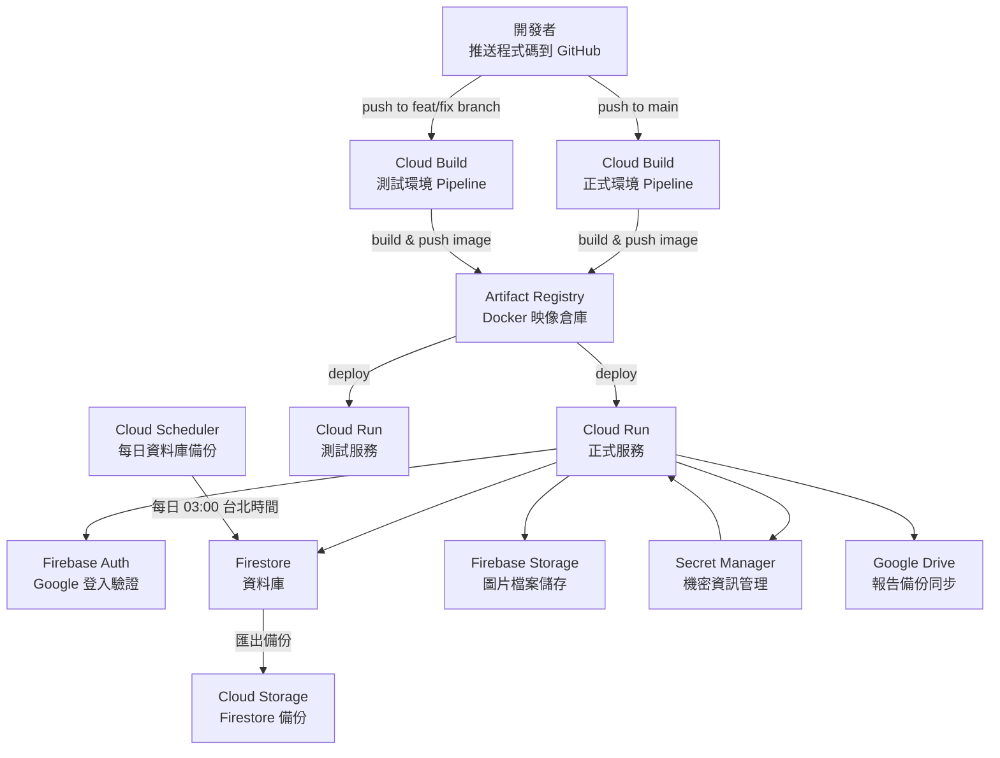

# 台大社會所課程期末報告平台

供台灣大學社會學研究所課程使用的期末報告發布平台。學生以 Markdown 撰寫報告，教師審核後發布，已發布的報告會成為公開、可被搜尋引擎索引的網頁。

| 環境         | 網址                                                                |
| ------------ | ------------------------------------------------------------------- |
| **正式環境** | https://course-final-paper-website-1092980609324.asia-east1.run.app |
| **測試環境** | https://course-paper-test-cefyizhe7q-de.a.run.app                   |

---

## 系統架構



---

## 主要功能

### 學生

- 以 Markdown 撰寫期末報告，支援即時預覽
- 每 30 秒自動儲存（亦可按 Ctrl+S 手動儲存）
- 拖放或貼上剪貼簿上傳圖片，並透過側邊欄管理已上傳的圖片
- 設定報告基本資訊：標題、作者名稱、摘要、封面圖片
- 從統一的工作區查看所有已選修的課程

### 教師（管理員）

- 建立課程，系統自動產生 6 字元選課代碼
- 審核學生報告：最新草稿、與上次發布版本的差異比對、完整發布歷史
- 以確認對話框發布或取消發布報告
- 每份報告顯示狀態標籤：`未發布`、`已發布`、`已發布 + 有更新待審核`
- 重新產生選課代碼；開啟或關閉課程選課

### 公開頁面

- 以分頁切換課程；各課程分頁列出已發布報告（含封面圖、標題、作者、摘要）
- 個別報告頁面完整渲染 Markdown（支援 GFM、程式碼語法標亮、KaTeX 數學公式、腳注、內嵌媒體）
- 支援 YouTube、Instagram、Facebook、Threads 網址自動內嵌
- SEO metadata、Open Graph 圖片、sitemap、`robots.txt`

### 預覽模式

- 登入後的 `/preview` 路由可查看所有報告（含未發布草稿）
- 供課程成員在正式發布前審閱

### Google Drive 同步

- 每次儲存草稿或發布後，自動將 `report.md` 與 `metadata.json` 同步至 Google Drive 資料夾
- 資料夾結構：`<根目錄>/<課程名稱>/<email> - <顯示名稱>/`
- 同步為非同步執行（fire-and-forget）；Drive 發生錯誤時不會顯示給使用者

---

## 技術架構

| 層次     | 技術選擇                                               |
| -------- | ------------------------------------------------------ |
| 前端框架 | Next.js 16（App Router、Server Actions、RSC）          |
| 程式語言 | TypeScript 5 strict                                    |
| 樣式     | Tailwind CSS 4（CSS-first `@theme`），Forest 綠色主題  |
| 身份驗證 | Firebase Auth（Google OAuth）+ HttpOnly session cookie |
| 資料庫   | Firestore（Native mode，`asia-east1`）                 |
| 檔案儲存 | Firebase Storage                                       |
| 測試     | Vitest（單元測試）                                     |
| 套件管理 | pnpm 11                                                |

詳細技術說明請見 [src/README.md](src/README.md)。  
基礎設施詳細說明請見 [infra/README.md](infra/README.md)。

---

## 本地開發快速入門

### 前置需求

- Node.js 20+
- pnpm 11（`npm install -g pnpm@11`）
- Java 21+（Firestore 模擬器需要）
- Firebase CLI（`npm install -g firebase-tools`）

### 步驟

```bash
# 1. 安裝相依套件
pnpm install

# 2. 複製環境變數範本並填入設定
cp .env.example .env.local
# 編輯 .env.local，填入 Firebase 設定（詳見 .env.example 的說明）

# 3. 啟動 Firebase 模擬器（終端機一）
firebase emulators:start

# 4. 啟動 Next.js 開發伺服器（終端機二）
FIREBASE_USE_EMULATOR=1 NEXT_PUBLIC_FIREBASE_USE_EMULATOR=1 pnpm dev
```

開啟瀏覽器前往 http://localhost:3000 即可。

> 若要連接正式 Firebase（例如測試 Drive 同步功能），請在 `.env.local` 中將兩個旗標設為 `0`。

---

## 目錄結構

```
.
├── src/                    # 應用程式原始碼（詳見 src/README.md）
├── infra/                  # GCP 基礎設施 Terraform 設定（詳見 infra/README.md）
├── Dockerfile              # 多階段 Next.js standalone 建置
├── cloudbuild.yaml         # 正式環境 CI/CD Pipeline（Cloud Build）
├── cloudbuild-test.yaml    # 測試環境 CI/CD Pipeline（Cloud Build）
├── firebase.json           # Firebase CLI 設定（模擬器 port 等）
├── firestore.rules         # Firestore 安全規則
├── firestore.indexes.json  # Firestore 複合索引定義
├── storage.rules           # Firebase Storage 安全規則
└── .env.example            # 所有環境變數名稱與說明
```

---

## 環境變數

完整清單與說明請見 `.env.example`。主要分類：

| 分類                        | 變數                                                                                                                |
| --------------------------- | ------------------------------------------------------------------------------------------------------------------- |
| 管理員                      | `ADMIN_EMAILS`（逗號分隔的 email 清單）                                                                             |
| Firebase 前端（建置時注入） | `NEXT_PUBLIC_FIREBASE_*`                                                                                            |
| Google Drive 同步（執行期） | `GOOGLE_DRIVE_ROOT_FOLDER_ID`、`GOOGLE_DRIVE_CLIENT_ID`、`GOOGLE_DRIVE_CLIENT_SECRET`、`GOOGLE_DRIVE_REFRESH_TOKEN` |

---

## 測試

```bash
pnpm test         # Vitest 單元測試
pnpm typecheck    # TypeScript 型別檢查（tsc --noEmit）
pnpm lint         # ESLint 程式碼檢查
```

單元測試與被測試的模組放在同一目錄（`*.test.ts`）。主要測試對象：純函式工具、驗證器、URL 匹配、授權角色判斷、Firestore 轉換器。
