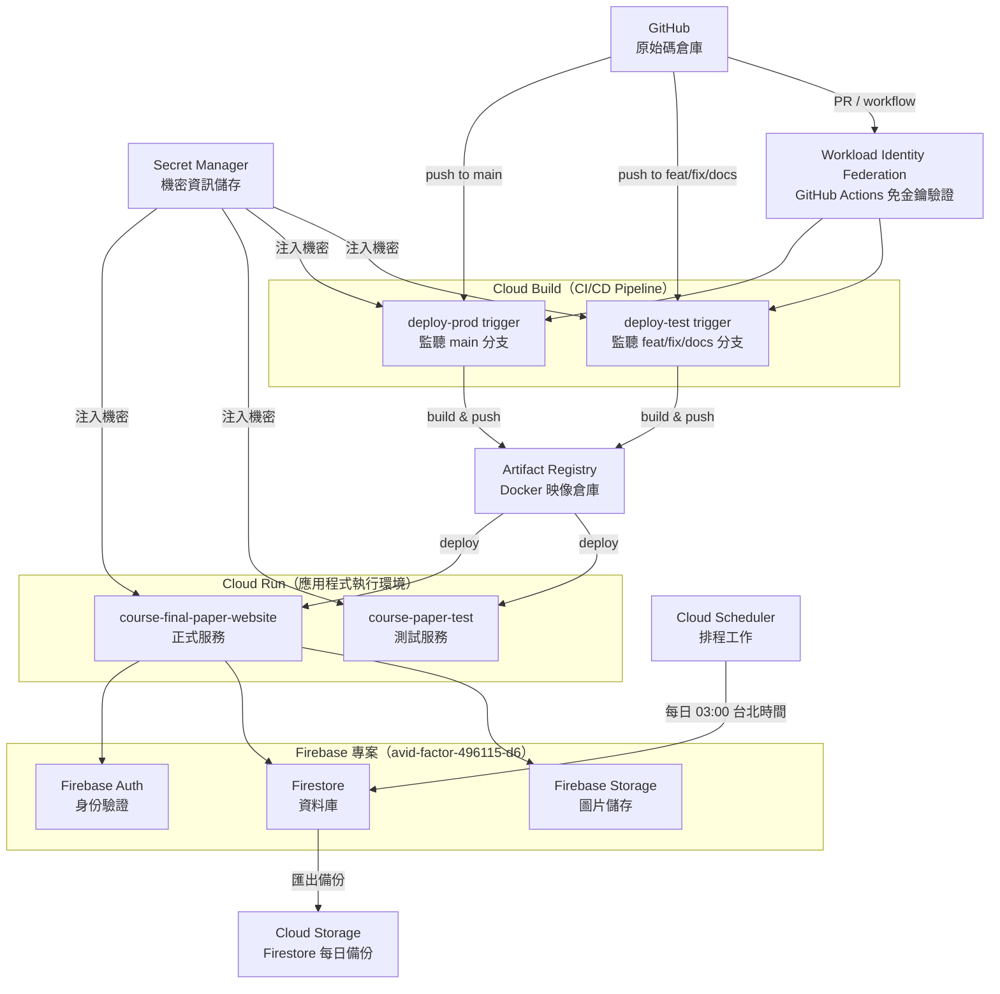

# GCP 基礎設施說明

本目錄下的所有 GCP 資源均由 **Terraform** 管理。Terraform 是一種「基礎設施即程式碼」（Infrastructure as Code）工具——你用程式碼描述你想要的雲端資源，Terraform 負責建立、更新或刪除它們，讓基礎設施的變更像程式碼一樣可以審查和追蹤。

**GCP 專案 ID**：`avid-factor-496115-d6`　**區域**：`asia-east1`

---

## 基礎設施架構



---

## 各資源說明

### Artifact Registry

**是什麼**：GCP 的 Docker 映像倉庫，類似 DockerHub 但托管在 GCP 內部。

**為什麼需要**：Cloud Build 建置好 Docker 映像後需要有地方存放，Cloud Run 部署時再從這裡拉取。映像以 Git commit SHA 為標籤，方便追蹤每次部署對應的程式碼版本。

| 倉庫名稱 | `course-final-paper-website` |
| -------- | ---------------------------- |
| 格式     | Docker                       |
| 區域     | `asia-east1`                 |

---

### Cloud Run（正式 + 測試）

**是什麼**：GCP 的無伺服器容器執行平台。把 Docker 映像丟進去，它負責啟動、擴展、縮減，完全不需要管理伺服器。

**為什麼需要**：Next.js 應用程式需要一個執行環境。Cloud Run 在無流量時自動縮減至 0（節省費用），有請求時自動擴展。

| 服務                         | 環境 | 觸發條件                  |
| ---------------------------- | ---- | ------------------------- |
| `course-final-paper-website` | 正式 | push to `main`            |
| `course-paper-test`          | 測試 | push to `feat/fix/docs/*` |

兩個服務都設為公開（不需身份驗證即可訪問），身份驗證由應用程式層自行處理。

---

### Cloud Build（正式 + 測試 Trigger）

**是什麼**：GCP 的 CI/CD 服務。當程式碼推送到 GitHub 指定分支，自動執行建置、測試、部署流程。

**為什麼需要**：自動化部署流程——開發者推送程式碼後，系統自動建置 Docker 映像、推送至 Artifact Registry、部署到 Cloud Run，不需要手動操作。

Pipeline 設定檔：

- 正式環境：`cloudbuild.yaml`（監聽 `main`）
- 測試環境：`cloudbuild-test.yaml`（監聽 `feat/fix/docs/*`）

---

### Secret Manager

**是什麼**：GCP 的機密資訊管理服務，用來安全儲存 API 金鑰、OAuth 憑證等敏感資料。

**為什麼需要**：Firebase 設定、Google Drive OAuth 憑證等機密不能直接寫在程式碼或環境變數檔案中。Secret Manager 加密儲存這些值，Cloud Build 和 Cloud Run 在需要時再讀取。

**儲存的機密**：

| 機密名稱                                                   | 用途                                 |
| ---------------------------------------------------------- | ------------------------------------ |
| `firebase-api-key` ... `firebase-app-id`（6 個）           | 正式環境 Firebase 設定（建置時注入） |
| `firebase-test-api-key` ... `firebase-test-app-id`（6 個） | 測試環境 Firebase 設定（建置時注入） |
| `google-drive-client-id`                                   | Google Drive OAuth 用戶端 ID         |
| `google-drive-client-secret`                               | Google Drive OAuth 用戶端密鑰        |
| `google-drive-refresh-token`                               | Google Drive OAuth Refresh Token     |
| `google-drive-root-folder-id`                              | 正式環境 Drive 根目錄 ID             |
| `google-drive-root-folder-id-test`                         | 測試環境 Drive 根目錄 ID             |

> **注意**：Terraform 只管理機密的「殼」（建立 Secret 資源和 IAM 權限），**實際值從不寫入程式碼**。值需要手動透過 `gcloud` 指令設定。

---

### Workload Identity Federation（WIF）

**是什麼**：一種讓 GitHub Actions 無需服務帳號金鑰檔案就能向 GCP 驗證身份的機制。

**為什麼需要**：Terraform 的 GitHub Actions workflow（`terraform-diff`、`terraform-apply`）需要操作 GCP 資源。傳統做法是把服務帳號 JSON 金鑰存在 GitHub Secrets，但這有安全風險（金鑰可能外洩、難以輪換）。WIF 讓 GitHub Actions 以 OIDC token 換取短效的 GCP 存取憑證，完全不需要長效金鑰。

---

### Cloud Scheduler

**是什麼**：GCP 的定時排程服務，類似 cron job。

**為什麼需要**：每天凌晨 3 點（台北時間）自動觸發 Firestore 資料庫備份，將資料匯出至 Cloud Storage。即使系統發生意外，也能從備份還原資料。

| 排程     | `0 19 * * *`（UTC）= 台北時間 03:00                  |
| -------- | ---------------------------------------------------- |
| 執行動作 | 呼叫 Firestore Export API                            |
| 備份目標 | `avid-factor-496115-d6-firestore-backups` GCS bucket |

---

### Cloud Storage（Firestore 備份）

**是什麼**：GCP 的物件儲存服務，類似 AWS S3。

**為什麼需要**：存放 Cloud Scheduler 每日觸發的 Firestore 備份資料。設定為永久保留（不自動刪除），讓所有歷史快照都可還原。

| Bucket 名稱 | `avid-factor-496115-d6-firestore-backups` |
| ----------- | ----------------------------------------- |
| 保留策略    | 永久（無到期時間）                        |

---

### Service Account（`course-paper-sa`）

**是什麼**：代表應用程式身份的 GCP 服務帳號，類似「機器人帳號」。

**為什麼需要**：Cloud Build、Cloud Run、Cloud Scheduler 執行操作時，需要一個身份來獲得對 GCP 資源的存取權限。使用單一服務帳號集中管理權限，比每個服務各自配置更容易維護。

---

### Firebase 專案

**是什麼**：Google 的應用程式開發平台，包含身份驗證、資料庫（Firestore）、檔案儲存等服務。

**為什麼需要**：

- **Firebase Auth**：處理 Google 登入，產生身份驗證 token
- **Firestore**：儲存所有應用程式資料（課程、報告、使用者等）
- **Firebase Storage**：儲存學生上傳的圖片

> Firebase 專案本身不由 Terraform 管理（透過 Firebase Console 建立）；Firestore 索引和安全規則由 Cloud Build 在每次部署時透過 `firebase-tools` 更新。

---

## 如何維護

### 理解 terraform-diff 和 terraform-apply

本專案的 Terraform 透過兩個 GitHub Actions workflow 自動執行：

#### `terraform-diff`（`.github/workflows/terraform-diff.yml`）

**何時觸發**：每次開啟 PR 或推送新 commit 至 PR 時。

**做什麼**：執行 `terraform plan`，分析你的變更會對 GCP 資源造成什麼影響，並將結果以留言形式貼在 PR 上。

**看什麼**：

- `+ create`：會新建資源
- `~ update in-place`：會更新資源設定（資源繼續存在）
- `-/+ destroy then create`：會**刪除再重建**資源（⚠️ 資料可能遺失）
- `- destroy`：會**刪除**資源（⚠️ 危險）

合併 PR 前，請仔細確認 plan 結果符合預期，特別注意任何 `destroy` 操作。

#### `terraform-apply`（`.github/workflows/terraform-apply.yml`）

**何時觸發**：PR 合併至 `main` 分支後自動執行；也可在 GitHub Actions 頁面手動觸發（workflow dispatch）。

**做什麼**：執行 `terraform apply`，將 `.tf` 設定檔中描述的狀態實際套用到 GCP。

**注意**：apply 是不可逆的操作。如果 plan 顯示會刪除重要資源，應先暫停並評估風險。

---

### 修改 Secret 值

Secret Manager 的「殼」由 Terraform 管理，但**值需要手動設定**：

```bash
# 新增或更新一個機密的值
echo -n "新的值" | gcloud secrets versions add SECRET_NAME \
  --data-file=- --project=avid-factor-496115-d6
```

例如輪換 Google Drive refresh token：

```bash
echo -n "新的-refresh-token" | gcloud secrets versions add google-drive-refresh-token \
  --data-file=- --project=avid-factor-496115-d6
```

更新後，Cloud Run 服務在下次部署時會自動讀取新版本的值（標註 `latest`）。

---

### 輪換 Google Drive Refresh Token

若 Drive 同步停止運作（通常是 refresh token 失效），需要重新授權：

1. 前往 [Google Cloud Console](https://console.cloud.google.com) → API 和服務 → 憑證
2. 找到 `Firebase Sync to Google Drive` OAuth 用戶端（Desktop 類型）
3. 下載用戶端設定，取得 `client_id` 和 `client_secret`
4. 在本機執行授權流程（參考舊版 `scripts/get-drive-token.mjs` 的邏輯）
5. 將新的 refresh token 存入 Secret Manager（見上方步驟）

---

## 目錄結構

```
infra/
  config/
    terraform.tfvars        # 變數值（已提交至 git，無機密）
  deployment/
    artifact-registry.tf    # Artifact Registry 倉庫
    backend.tf              # Terraform remote state（GCS bucket）
    cloud-build.tf          # Cloud Build trigger 設定
    cloud-run.tf            # Cloud Run 服務
    iam.tf                  # 服務帳號與 IAM 角色
    scheduler.tf            # Cloud Scheduler 排程
    secrets.tf              # Secret Manager 機密殼與存取權
    storage.tf              # GCS 備份 bucket
    variables.tf            # 變數宣告
    wif.tf                  # Workload Identity Federation
    .terraform.lock.hcl     # Provider 版本鎖定（已提交）
  README.md
```

在本機執行 Terraform：

```bash
terraform -chdir=infra/deployment init
terraform -chdir=infra/deployment plan  -var-file=../config/terraform.tfvars
terraform -chdir=infra/deployment apply -var-file=../config/terraform.tfvars -auto-approve
```

> Remote state 儲存在 GCS bucket `avid-factor-496115-d6-tfstate`，不在本目錄內。
