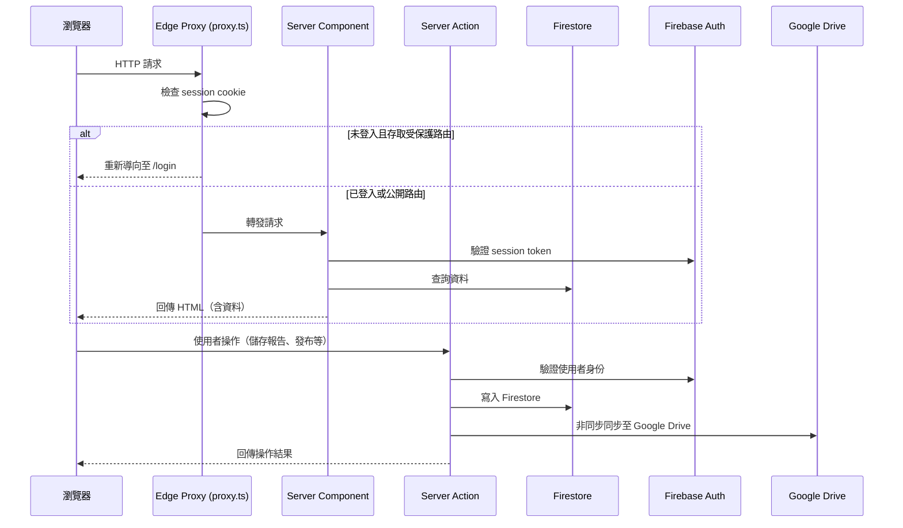
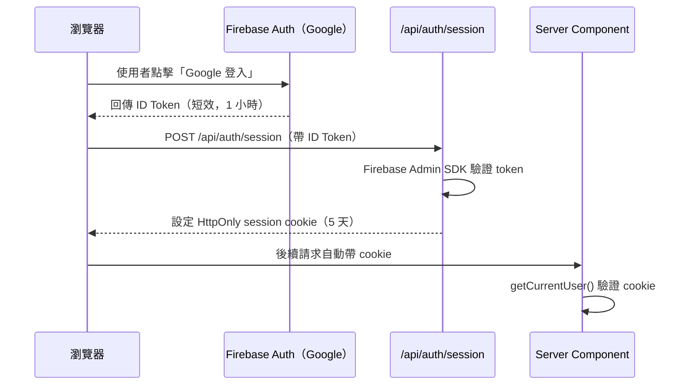

# src — 前端/後端技術說明

本文件說明應用程式的技術架構，協助未來的開發者理解各部分如何運作，以及新增功能時應該修改哪些地方。

---

## 技術架構概覽

本應用程式使用 **Next.js App Router**，結合了傳統前端與後端的概念。一個重要的觀念是：Next.js 中「前端」和「後端」的界線與傳統 Web 應用程式不同——許多元件在伺服器上執行，而非在使用者的瀏覽器中。

### 請求流程



---

## 前端、後端、資料庫互動說明

### 三種元件類型

Next.js App Router 中有三種主要的程式碼執行位置：

| 類型                       | 執行位置               | 說明                                                                                                                                  |
| -------------------------- | ---------------------- | ------------------------------------------------------------------------------------------------------------------------------------- |
| **Server Component (RSC)** | 伺服器                 | 預設類型。直接查詢 Firestore，HTML 在伺服器渲染後傳給瀏覽器。使用者看不到原始資料，只看到已渲染的頁面。                               |
| **Client Component**       | 瀏覽器                 | 檔案頂端有 `"use client"` 宣告。處理互動（點擊、輸入、即時預覽）。無法直接存取 Firestore 或 Secret Manager。                          |
| **Server Action**          | 伺服器（被瀏覽器呼叫） | 函式頂端有 `"use server"` 宣告。由 Client Component 呼叫，在伺服器執行資料寫入。類似傳統的 API endpoint，但不需要另外建 `/api` 路由。 |

### 身份驗證流程



HttpOnly cookie 的好處是 JavaScript 無法讀取，防止 XSS 攻擊竊取登入狀態。

---

## 資料庫結構

使用 **Firestore**（NoSQL 文件型資料庫）。資料以「集合（collection）→文件（document）」的方式組織，類似資料夾裡放檔案。

```
users/{uid}
  ├── email                  Google 帳號 email
  ├── displayNameGoogle      Google 帳號顯示名稱
  ├── photoURLGoogle         Google 頭像 URL
  ├── profileDisplayName     學生自設的公開作者名稱
  └── role                   "student" | "admin"

courses/{courseId}
  ├── name                   課程名稱
  ├── year / semester        學年度 / 學期
  ├── description            課程說明
  ├── coverImageUrl          封面圖
  ├── code                   6 字元選課代碼
  ├── enrollmentOpen         是否開放選課（bool）
  └── driveFolderId          對應的 Google Drive 資料夾 ID

enrollments/{courseId}_{uid}
  ├── courseId
  ├── uid
  └── enrolledAt

reports/{reportId}           id = {courseId}_{uid}（一課程一學生一份報告）
  ├── courseId / uid
  ├── title / author / summary / coverImageUrl
  ├── contentMd              最新草稿（Markdown 全文）
  ├── publishedAt            null 表示尚未發布
  ├── hasNewChanges          草稿與最後發布版本是否有差異
  └── driveFolderId

reports/{reportId}/publishSnapshots/{snapshotId}
  ├── contentMd / title / author / summary / coverImageUrl
  ├── publishedAt
  └── publishedBy            發布者 uid

reports/{reportId}/uploads/{uploadId}
  ├── filename / storagePath / downloadURL
  ├── sizeBytes / contentType
  └── uploadedAt
```

---

## 路由對照表

| 路由                                     | 需要登入 | 說明                                       |
| ---------------------------------------- | -------- | ------------------------------------------ |
| `/`                                      | 否       | 首頁，顯示課程分頁與已發布報告列表         |
| `/c/[courseSlug]`                        | 否       | 指定課程的公開頁面                         |
| `/c/[courseSlug]/r/[reportSlug]`         | 否       | 閱讀已發布報告                             |
| `/login`                                 | 否       | Google 登入頁面                            |
| `/privacy`、`/tos`                       | 否       | 隱私政策與服務條款                         |
| `/preview`                               | 需登入   | 預覽所有草稿（含未發布）                   |
| `/workspace`                             | 需登入   | 學生工作區，顯示已選修課程                 |
| `/workspace/onboarding`                  | 需登入   | 初次使用引導（輸入選課代碼、設定名稱）     |
| `/workspace/settings`                    | 需登入   | 修改個人顯示名稱                           |
| `/workspace/c/[courseId]`                | 需登入   | Markdown 編輯器                            |
| `/admin`                                 | 需管理員 | 課程列表                                   |
| `/admin/courses/new`                     | 需管理員 | 建立新課程                                 |
| `/admin/courses/[courseId]`              | 需管理員 | 課程詳細頁 + 學生報告列表                  |
| `/admin/courses/[courseId]/r/[reportId]` | 需管理員 | 報告審核（最新草稿 / 差異比對 / 發布歷史） |

---

## 如何開發新功能

以下說明各資料夾的職責，以及面對不同類型的需求時應該修改哪裡。

### 新增或修改頁面 → `src/app/`

每個資料夾對應一個 URL 路徑。

```
src/app/
├── (public)/           # 公開頁面（不需登入）
│   ├── c/[courseSlug]/ # /c/xxx 課程頁
│   └── login/          # 登入頁
├── admin/              # 管理員頁面（/admin/*）
├── preview/            # 預覽模式（/preview/*）
├── workspace/          # 學生工作區（/workspace/*）
└── api/                # API Route Handler（特殊端點）
    └── auth/session/   # 登入後設定 session cookie
```

每個頁面通常有：

- `page.tsx`：頁面主體（Server Component，直接查詢 Firestore）
- `layout.tsx`：共用版面（導覽列等）
- `loading.tsx`：載入中的 Skeleton 畫面
- `client.tsx` 或 `editor.tsx`：需要互動的部分（Client Component）

**新增一個頁面**：在對應路徑建立 `page.tsx`，資料查詢在伺服器端進行（直接呼叫 `src/lib/server/firestore.ts` 中的函式），互動邏輯抽成 Client Component。

---

### 新增資料操作（寫入、更新、刪除）→ `src/actions/`

Server Actions 是「可以從前端呼叫的後端函式」。每個操作對應一個函式：

| 檔案            | 包含的操作                                               |
| --------------- | -------------------------------------------------------- |
| `auth.ts`       | 登入、登出                                               |
| `course.ts`     | 建立課程、更新課程資訊、開關選課、重新產生代碼、移除學生 |
| `enrollment.ts` | 以代碼選課                                               |
| `profile.ts`    | 修改個人顯示名稱                                         |
| `report.ts`     | 儲存草稿                                                 |
| `publish.ts`    | 發布報告、取消發布                                       |

**新增一個操作**：在對應的 `actions/` 檔案中新增一個 `async function`，在函式頂端加上 `"use server"` 宣告，並在開頭呼叫 `getCurrentUser()` 驗證使用者身份和權限。

---

### 新增共用 UI 元件 → `src/components/`

```
src/components/
├── ui/         # 基本 UI 元件：Button, Input, Label, Skeleton, StatusTag
├── admin/      # 管理員專用元件
├── auth/       # 登入相關元件
├── editor/     # 編輯器相關元件（檔案管理側邊欄等）
└── public/     # 公開頁面元件
```

若是跨頁面共用的元件（如 Header、Footer），直接放在 `src/components/` 根目錄。

---

### 新增 Firestore 查詢 → `src/lib/server/firestore.ts`

所有讀取 Firestore 的邏輯集中在這個檔案。新增查詢函式後，在 Server Component 的 `page.tsx` 中呼叫。

使用 Firestore 時要透過 `src/lib/firestore/converters.ts` 中的 converter，確保型別安全。

---

### 修改或新增資料型別 → `src/lib/types.ts`

所有 Firestore 文件的 TypeScript 介面（`Course`、`Report`、`User` 等）定義在這裡。修改 Firestore 結構時，先更新這裡的型別定義。

---

### 新增環境變數 → `src/lib/env.ts`

所有環境變數都透過 Zod schema 驗證：

- **伺服器端變數**（不暴露給瀏覽器）：加入 `serverSchema`
- **前端變數**（瀏覽器可讀取）：名稱必須以 `NEXT_PUBLIC_` 開頭，加入 `clientSchema`

新增後，在 `.env.example` 加上說明，並更新 `cloudbuild.yaml` / `cloudbuild-test.yaml`（如果需要在 CI/CD 中注入）。

---

### 修改 Firestore 安全規則 → `firestore.rules`

Firestore 安全規則決定哪些使用者可以讀取或寫入哪些文件。**修改後需要部署才會生效**：

```bash
firebase deploy --only firestore:rules --project=avid-factor-496115-d6
```

或者直接 push 到 `main`，Cloud Build 會在部署過程中自動更新。

---

### 新增 Firestore 複合索引 → `firestore.indexes.json`

當你的查詢使用多個欄位排序或過濾，Firestore 需要複合索引。若查詢失敗並在 log 中看到「index required」錯誤，按照錯誤訊息中的連結建立索引，或直接在 `firestore.indexes.json` 中新增定義。

部署方式同上，或透過 Cloud Build 自動部署。

---

## 關鍵模組說明

### `lib/server/auth.ts` — 身份驗證

- `getCurrentUser()`：讀取 `session` HttpOnly cookie，用 Firebase Admin SDK 驗證，回傳包含 role 的 `User` 物件，或 `null`
- `isAdminEmail(email)`：檢查是否在 `ADMIN_EMAILS` 環境變數的清單中

所有 Server Action 和需要驗證的 Server Component 都從這裡取得使用者資訊。

### `lib/server/drive.ts` — Google Drive 同步

負責將報告備份至 Google Drive：

- `syncReportToDrive(reportId)`：儲存草稿或發布後呼叫
- `renameCourseFolder(courseId)`：課程改名後呼叫
- `renameStudentFolders(uid, email, newDisplayName)`：學生改名後呼叫

所有 Drive 操作都是 fire-and-forget（非同步執行，錯誤不影響使用者）。

### `lib/markdown/` — Markdown 渲染

`<MarkdownRenderer>` 元件處理所有 Markdown 渲染（公開頁面、編輯器預覽、管理員差異比對）。支援 GFM、數學公式（KaTeX）、程式碼語法標亮（Shiki）、YouTube/Instagram/Facebook/Threads 網址自動內嵌。

### `proxy.ts` — Edge Middleware 認證閘道

在每個請求到達頁面前執行，只做一件事：檢查 `session` cookie 是否存在。若存取 `/workspace`、`/admin`、`/preview` 但沒有 cookie，重新導向至登入頁。完整的 token 驗證由各頁面的 Server Component 負責。

---

## 測試

```bash
pnpm test      # 執行所有 Vitest 單元測試
```

測試檔案與被測試的模組放在同一目錄（`*.test.ts`）：

| 測試檔案                           | 測試內容                     |
| ---------------------------------- | ---------------------------- |
| `lib/courseCode.test.ts`           | 選課代碼產生器、字元排除規則 |
| `lib/markdown/embedSchema.test.ts` | 各平台 URL 的識別邏輯        |
| `lib/server/auth.test.ts`          | 管理員 email 判斷邏輯        |
| `lib/server/drive.test.ts`         | Drive 資料夾名稱產生邏輯     |

新增非純函式功能時不需要寫測試；**新增純函式邏輯**（工具函式、驗證器、URL 匹配、資料轉換）時請加上對應的測試。
